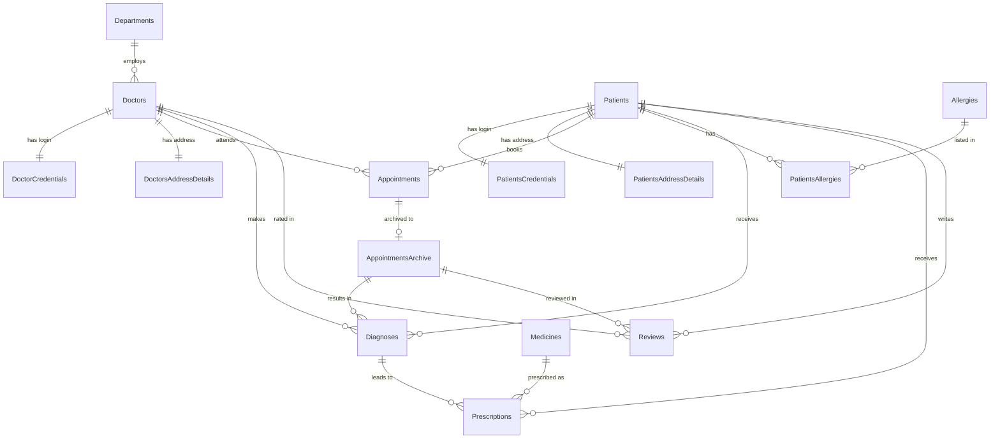

# ElyonHospitals Database System

A hospital management database in T-SQL: schema design, security-conscious data handling,
stored procedures, triggers, functions and reporting queries. Originally built as MSc
coursework; since revisited to fix bugs and add showcase queries (see `CHANGES.md`).

## What's demonstrated

- **Schema design**: 15 tables covering patients, doctors, departments, appointments,
  diagnoses, prescriptions and allergies, with a composite-key junction table
  (`PatientsAllergies`) and a live/archive split for appointments.
- **Data integrity**: CHECK constraints (dates of birth, gender codes, email patterns,
  rating bounds), UNIQUE constraints, and foreign keys throughout.
- **Security thinking**: credentials held in separate tables; insurance numbers, licence
  numbers and passwords stored as SHA2-256 hashes, never plain text.
- **Stored procedures**: appointment scheduling and cancellation with transactions and
  TRY/CATCH error handling; a partial-update procedure using the ISNULL pattern;
  multi-table insert with SCOPE_IDENTITY().
- **Triggers**: a scoped AFTER UPDATE trigger that archives completed and cancelled
  appointments automatically.
- **Views and functions**: a UNION view across live and archived appointments;
  scalar functions for doctor ratings and department appointment counts.
- **Reporting**: `3_queries.sql` — six management questions answered with joins, window
  functions, CTEs, STRING_AGG and conditional aggregation.

## Entity-relationship diagram

## Files (run in order)

| File | Purpose |
|---|---|
| `1_schema_procedures_data.sql` | Schema, seed data, procedures, triggers, views, functions |
| `2_fixes.sql` | Bug fixes and improvements (run after step 1) |
| `3_queries.sql` | Showcase reporting queries |
| `CHANGES.md` | What was fixed and why |

## How to run

1. Open SQL Server Management Studio (or Azure Data Studio).
2. Run `1_schema_procedures_data.sql` to create and populate the database.
3. Run `2_fixes.sql` to apply the corrections.
4. Explore with `3_queries.sql`.

## Honest limitations

- Password hashing uses unsalted SHA2-256 — fine for a coursework demo, but a real
  system would use a salted, slow algorithm (bcrypt/Argon2) via the application layer.
- Seed data is small and synthetic; some names/usernames are intentionally imperfect.
- No indexing strategy beyond primary keys — a production system would index the
  common join and filter columns.
